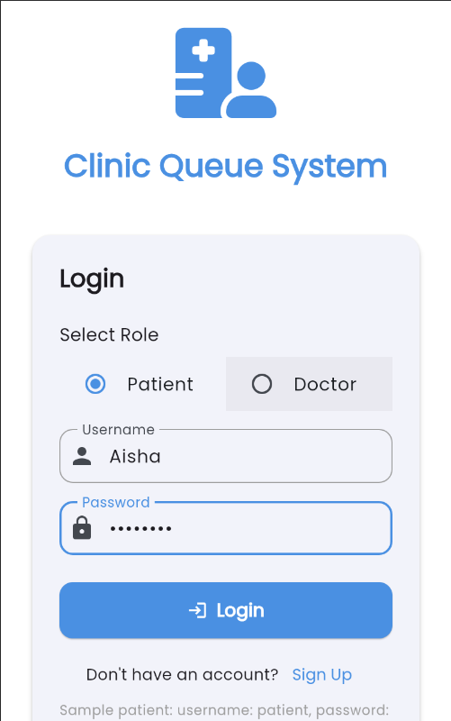
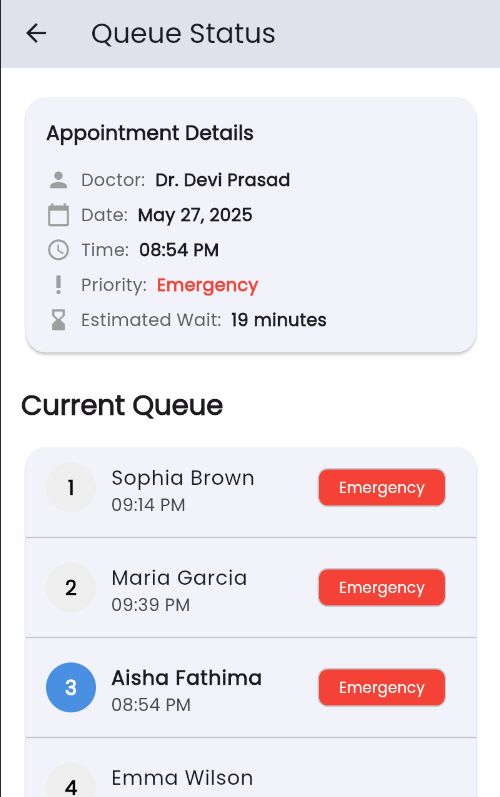
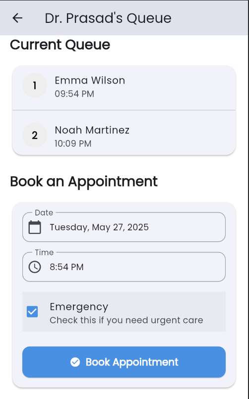
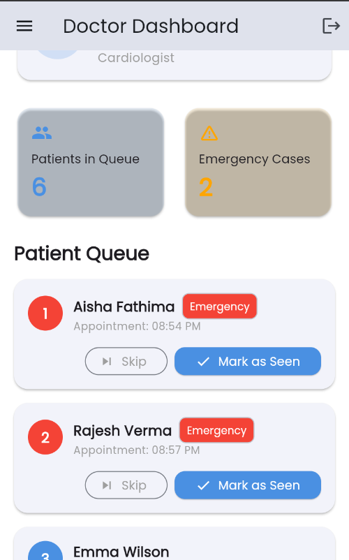

# flutter_clinic_queue

**A Flutter application for managing clinic queues.**

## Project Description

`flutter_clinic_queue` is a Flutter application designed to streamline and manage patient queues in a clinic setting. It aims to improve the patient experience and optimize clinic workflow.

**Key Features:**

*   **Queue Management:** Easily add, remove, and reorder patients in the queue.
*   **Real-time Updates:** Provides real-time updates on queue status.
*   **Patient Information:** Stores basic patient information (name, appointment time, etc.).
*   **User-Friendly Interface:** Intuitive and easy-to-use interface for both clinic staff and doctors.
*   **History Tracking:** Maintains a history of queue activity for reporting and analysis.
*   **Emergency Patient Handling:** Mark patients as emergency cases to prioritize them in the queue.
*   **Patient Skipping:** Skip patients who are not present, temporarily removing them from the queue.
*   **Priority Queue:** Emergency patients are automatically given the highest priority.
*   **Notifications:** Sends notifications to patients when their turn is approaching (future enhancement).
*   **Doctor Interface:** Dedicated interface for doctors to view the queue and manage patient status.

## Getting Started

Follow these instructions to get the app up and running on your local machine.

### Prerequisites

*   [Flutter SDK](https://flutter.dev/docs/get-started/install)
*   [Android Studio](https://developer.android.com/studio) or [VS Code](https://code.visualstudio.com/) with Flutter extension
*   [Git](https://git-scm.com/)

### Installation

1.  **Clone the repository:**

bash
cd flutter_clinic_queue
*   `flutter: sdk: flutter`
*   (List other dependencies from `pubspec.yaml` here with versions)
    Example:
    *   `cupertino_icons: ^1.0.2`
    *   `intl: ^0.17.0`

## Usage

Once the app is running, clinic staff and doctors can use the following functionalities:

1.  **Add a patient to the queue:** Enter the patient's name and appointment time, then tap the "Add to Queue" button.
2.  **Mark as Emergency:** When adding or editing a patient, mark them as an emergency if needed. This will prioritize them in the queue.
3.  **View the queue:** The main screen displays the current queue with patient names, estimated wait times, and emergency status.
4.  **Remove a patient from the queue:** Select a patient from the queue and tap the "Remove" button.
5.  **Skip a patient:** If a patient is not present, you can "Skip" them.  This will temporarily remove them from the queue, and you can re-add them later if they arrive.
6.  **View queue history:** Access the history screen to see a log of past queue activity.

### Doctor Specific Actions:

1.  **View Patient Details:** Doctors can select a patient from the queue to view detailed information.
2.  **Mark Patient as 'In Consultation':** Indicate when a patient is currently being seen by the doctor.
3.  **Mark Patient as 'Consultation Finished':**  Indicate when a patient's consultation is complete, removing them from the active queue.

### Screenshots

## License

This project is licensed under the [MIT License](LICENSE) - see the `LICENSE` file for details.
